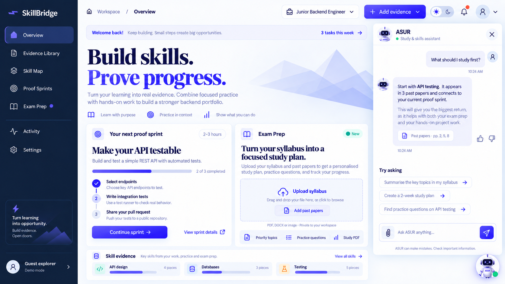
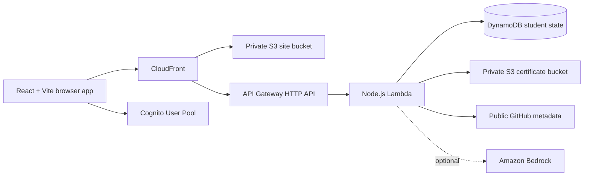

<h1 align="center">SkillBridge</h1>

<p align="center"><strong>Turn real work into career evidence, and study material into a focused exam plan.</strong></p>

<p align="center">
  <a href="https://d2jf84xfst7f2n.cloudfront.net/">Live demo</a> ·
  <a href="#quick-start">Run locally</a> ·
  <a href="#project-structure">Project structure</a>
</p>

<p align="center">
  
  
  
  
</p>

<p align="center">
  
</p>

> The image above is the approved dashboard **design reference**. Open the [live demo](https://d2jf84xfst7f2n.cloudfront.net/) to see the current application.

## Contents

- [Overview](#overview)
- [Features](#features)
- [Architecture](#architecture)
- [Tech stack](#tech-stack)
- [Project structure](#project-structure)
- [Quick start](#quick-start)
- [Testing](#testing)
- [Deployment](#deployment)
- [Current limits](#current-limits)

## Overview

SkillBridge helps students show what their projects demonstrate, find gaps in their public evidence, and build a focused **Proof Sprint**. Its **Exam Prep** area reads supported syllabus and past-paper files, suggests study priorities with page references, and generates practice questions, a seven-day plan, and a downloadable study guide.

The application has a guest demo and a signed-in student journey. The guest demo keeps progress in the browser. On the deployed site, signed-in state uses Amazon Cognito, API Gateway, Lambda, and DynamoDB. Certificates are stored in a private S3 bucket.

## Features

| Area | What it does |
| --- | --- |
| Guest demo | Explore the dashboard and public GitHub analysis without creating an account. |
| Evidence Library | Add public repositories and project links; label findings with source paths and explicit uncertainty. |
| Skill Map | Show which skills have strong, limited, or no **public repository** evidence. |
| Proof Sprints | Suggest a small practical task and inspect a submitted public GitHub link without running its code. |
| Exam Prep | Read text-based PDF, TXT, and Markdown syllabi and past papers; show cited topics, questions, and a study plan. |
| Study PDF | Download a guide generated from the readable uploaded material. |
| ASUR | Ask about public evidence or uploaded study text. Guided answers cite sources; optional Amazon Bedrock can provide model-generated responses when configured. |
| Student account | Email/password sign-in through Cognito on the deployed site, with private state and certificate uploads. |
| Interface | Responsive dashboard, light/dark preference, and an ASUR robot that opens and minimizes chat without losing the conversation. |

### Important distinction

ASUR's deployed demo currently uses **guided responses** unless a Bedrock model is explicitly configured. A guided response is useful for source-linked questions, but it is not proof that generative AI is active. SkillBridge never treats study priorities as guaranteed exam questions or repository file paths as proof of code quality.

## Architecture



Guest study files are parsed in the browser. When a guest asks ASUR about a document, the app sends selected extracted text to the SkillBridge API for that answer. Public demo calls do not save guest documents to DynamoDB. Signed-in state is stored privately through authenticated API routes.

## Tech stack

| Layer | Technology |
| --- | --- |
| Frontend | React 19, TypeScript, Vite 6, CSS, Lucide icons |
| Document handling | `pdfjs-dist` for readable PDFs, `jsPDF` for the study guide |
| Authentication | AWS Amplify client + Amazon Cognito User Pools |
| API | API Gateway HTTP API + Node.js Lambda |
| Data | DynamoDB for signed-in state; private S3 for certificate uploads |
| Hosting | Private S3 site bucket behind CloudFront |
| Infrastructure | AWS CDK in TypeScript |
| Optional AI | Amazon Bedrock Converse API; guided fallback without a model |

## Project structure

```text
.
├── backend/
│   ├── handler.js                 # API routes, evidence checks, ASUR responses
│   └── local-server.js            # Local API on port 8788
├── design/
│   └── approved-dashboard-v2.png  # Dashboard design reference
├── infra/
│   └── app.ts                     # AWS CDK stack
├── scripts/
│   └── deploy.ps1                 # Guarded AWS deployment script
├── src/
│   ├── App.tsx                    # Main app, navigation, auth, and ASUR panel
│   ├── Overview.tsx               # Dashboard and Exam Prep entry points
│   ├── ExamPrepPage.tsx           # Study uploads and results
│   ├── exam.ts                    # Text extraction and study PDF generation
│   ├── api.ts                     # API and Cognito client wiring
│   ├── AsurPreview.tsx            # Closed-chat dashboard panel
│   ├── AsurRobot.tsx              # ASUR character
│   ├── styles.css                 # Responsive layouts and themes
│   └── types.ts                   # Application data types
├── tests/
│   ├── fixtures/                  # Synthetic document test files
│   └── *.test.mjs                 # API, auth, Exam Prep, and UI tests
├── .gitignore
├── cdk.json
├── index.html
├── package.json
├── package-lock.json
├── tsconfig.json
└── vite.config.ts
```

Generated builds, local deployment outputs, credentials, temporary work, and unrelated personal files are excluded from this repository.

## Quick start

**Prerequisites:** Node.js 22 or later, npm, and Git. The guest demo does not require AWS credentials.

```bash
git clone https://github.com/piyushkr21/AWS-SkillBridge-PROJECT.git
cd AWS-SkillBridge-PROJECT
npm ci
```

Start the API and frontend in **separate terminals**:

```bash
npm run dev:api
```

```bash
npm run dev
```

Open **http://localhost:5173** and choose **Explore Guest demo**. The local API listens on `127.0.0.1:8788`. Sign-in is a live AWS feature; the local guest demo works without Cognito configuration.

## Testing

```bash
npm test
npm run build
npm run infra:synth
```

The test suite covers API behavior, auth UI, Exam Prep and document citations, and UI interactions. The production build and CDK synthesis have also been run locally. Browser checks on the deployed site covered guest analysis, Cognito sign-in, saved student state, certificate upload, proof checks, Exam Prep, ASUR chat, theme preference, and mobile navigation.

## Deployment

The current public site is **[https://d2jf84xfst7f2n.cloudfront.net/](https://d2jf84xfst7f2n.cloudfront.net/)**. The AWS stack is in `infra/app.ts` and the PowerShell deployment script is in `scripts/deploy.ps1`.

The script requires an explicit AWS profile and account ID, verifies the caller, and refuses a root ARN before provisioning. Review the CDK diff, AWS permissions, and costs before running a deployment. Never commit credentials or paste verification codes into source files.

## Current limits

- Exam Prep accepts **text-based PDF, TXT, and Markdown**. Scanned PDFs, images, encrypted PDFs, and DOCX require a separate OCR or conversion step.
- Study topics are suggestions based on readable uploaded text; they are **not exam predictions**.
- Repository checks inspect public metadata and file paths. They do not execute code or verify a student's mastery.
- ASUR does not read private certificate contents in this version.
- Bedrock is optional and was not enabled for the published demo; guided responses are labeled as such.
- An ordinary Chrome download of the study PDF has not yet been manually verified, although automated tests checked the generated PDF bytes.

---

<p align="center">Built by <a href="https://github.com/piyushkr21">Piyush Kumar</a></p>
